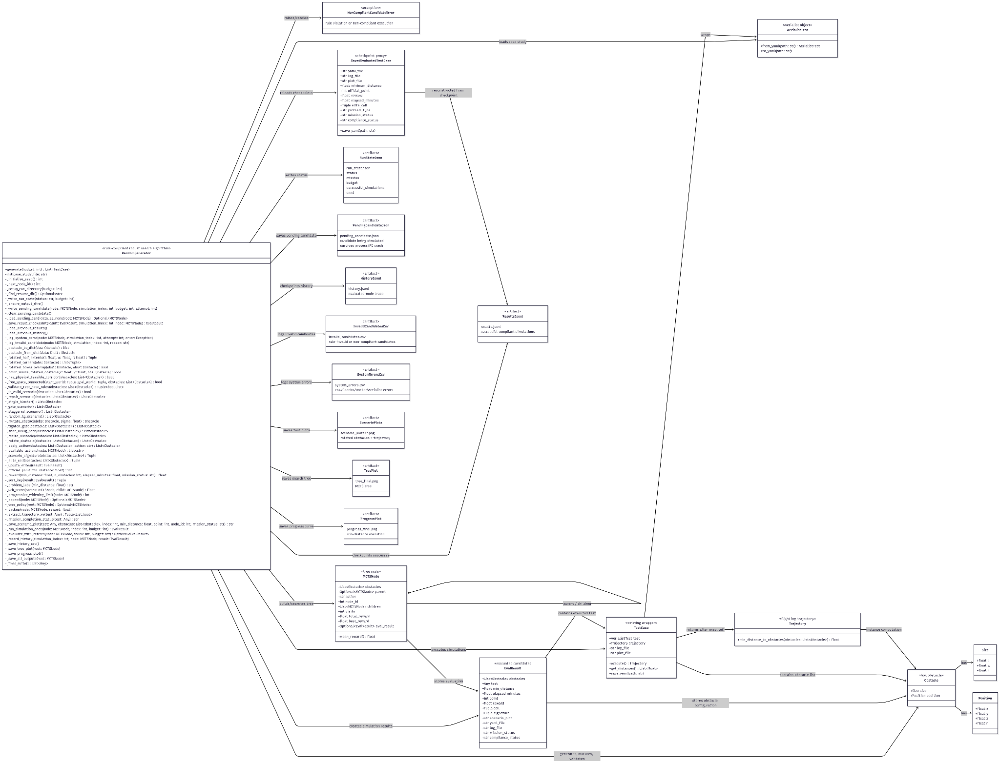
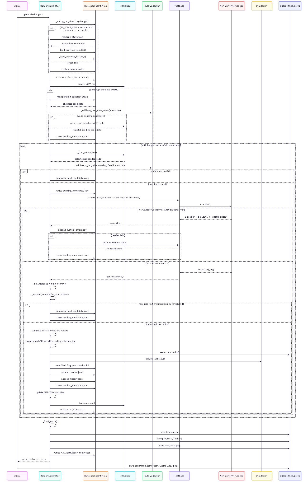
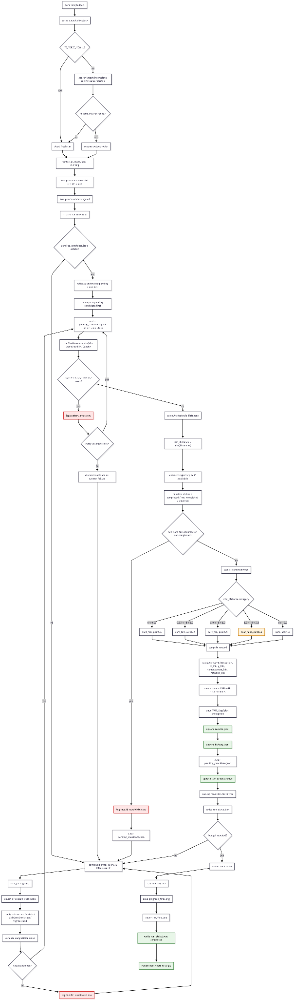

# TG-MCTS-Elites UAV Test Generator

Rule-compliant search-based test generator for the UAV Testing Competition.

This project automatically generates obstacle configurations for PX4-Avoidance missions and searches for scenarios where the UAV collides with, or passes dangerously close to, obstacles.

The generator combines:

- Trajectory-guided generation
- Monte Carlo Tree Search
- MAP-Elites diversity preservation
- Rule-compliant obstacle validation
- Crash recovery and checkpointing

---

## Project Goal

The objective is to automatically generate valid obstacle configurations that expose weaknesses in PX4-Avoidance.

Given a mission and a set of obstacles, the simulator returns the UAV trajectory. The main quantity optimized by the algorithm is:

    min_distance = minimum distance between the UAV trajectory and all generated obstacles

The search tries to minimize this value while keeping the generated test case valid.

| Type | Condition | Meaning |
|---|---:|---|
| Hard fail | min_distance < 0.25 m | Collision or almost-collision |
| Soft fail | 0.25 m <= min_distance < 1.5 m | Unsafe close pass |
| Near miss | 1.5 m <= min_distance < 3.0 m | Interesting but not officially unsafe |
| Safe | min_distance >= 3.0 m | Valid but less interesting |

---

## Official Test Generation Rules

The generator respects the obstacle-generation constraints of the competition.

Each generated obstacle is a rotated box defined by:

    position = (x, y, z, r)
    size     = (l, w, h)

with the following constraints:

| Parameter | Constraint |
|---|---:|
| x | -40 <= x <= 30 |
| y | 10 <= y <= 40 |
| z | z = 0 |
| l | 2 <= l <= 20 |
| w | 2 <= w <= 20 |
| h | 10 < h <= 25 |
| r | 0 <= r <= 90 |
| Number of obstacles | at most 3 |
| Overlap | obstacles must not overlap |
| Feasibility | obstacle layout must not block the mission corridor |

The current implementation checks:

- valid numerical bounds;
- rotated obstacle corners inside the valid area;
- rotated box overlap using polygon projection;
- physical feasibility using a grid-based free-space connectivity test;
- mission completion when the trajectory can be extracted.

---

## Algorithm Overview

The implemented algorithm is called TG-MCTS-Elites.

    TG-MCTS-Elites =
        Trajectory-Guided initialization
      + Monte Carlo Tree Search
      + MAP-Elites archive

### 1. Trajectory-Guided Generation

Instead of placing obstacles completely randomly, the generator samples them near expected mission corridors.

It creates several families of scenarios:

- single blocker;
- two-obstacle gate;
- staggered obstacle layout.

This increases the probability of generating challenging tests.

### 2. Monte Carlo Tree Search

The MCTS tree represents successive obstacle modifications.

Each node contains one obstacle configuration.  
Each edge corresponds to an action such as:

- init_single
- init_gate
- init_staggered
- mutate_local
- mutate_strong
- slide_y
- resize
- rotate
- tighten_gate
- add_blocker

The selection step uses an Upper Confidence Bound score:

    UCB = mean_reward + C * sqrt(log(parent_visits + 1) / child_visits)

Progressive widening limits the number of children expanded from each node.

### 3. MAP-Elites Archive

MAP-Elites keeps diverse high-quality candidates.

Each obstacle configuration is assigned to a cell:

    cell = (
        number_of_obstacles,
        x_position_bin,
        y_position_bin,
        compactness_bin,
        rotation_bin
    )

For each cell, the archive stores the best candidate found so far.

This avoids returning many almost-identical tests.

---

## Reward Function

The reward favors:

- official failures;
- smaller minimum distance;
- fewer obstacles;
- mission completion;
- faster simulations.

The structure is:

    reward =
        failure_bonus
      + closeness_reward
      + simplicity_bonus
      + mission_bonus
      - time_penalty

where:

    failure_bonus    = 25 * official_point
    closeness_reward = 5 / (0.2 + min_distance)
    simplicity_bonus = 4 / number_of_obstacles

The official point is:

| Condition | Point |
|---|---:|
| min_distance < 0.25 | 5 |
| 0.25 <= min_distance < 1.0 | 2 |
| 1.0 <= min_distance < 1.5 | 1 |
| min_distance >= 1.5 | 0 |

---

## Repository Structure

    .
    ├── README.md
    ├── Dockerfile
    ├── requirements.txt
    ├── cli.py
    ├── testcase.py
    ├── random_generator.py
    ├── run_all_100.sh
    ├── case_studies/
    │   ├── mission1.yaml
    │   ├── mission2.yaml
    │   ├── mission3.yaml
    │   ├── mission1.plan
    │   ├── mission2.plan
    │   └── mission3.plan
    └── docs/
        └── uml/
            ├── Class_Diagram.png
            ├── Execution_Flow.png
            └── Sequence_Diagram.png

---

## Main Files

### random_generator.py

Contains the complete TG-MCTS-Elites algorithm.

Main responsibilities:

- obstacle generation;
- rule validation;
- MCTS search;
- MAP-Elites archive;
- simulation execution;
- crash recovery;
- result ranking;
- plot generation.

### testcase.py

Wrapper around Aerialist/PX4 test execution.

Main responsibilities:

- create an executable test case;
- launch simulation;
- extract obstacle distances;
- save generated YAML files.

### cli.py

Command-line entry point.

Example:

    python cli.py generate case_studies/mission1.yaml 10

### run_all_100.sh

Runs the full experiment:

    mission1: 100 simulations
    mission2: 100 simulations
    mission3: 100 simulations

---

## Installation

Activate the environment used for the project:

    conda activate uav

Go to the project folder:

    cd /home/roby/Projects/UAV-Testing-Competition/snippets

Install missing Python dependencies if needed:

    python -m pip install -r requirements.txt
    python -m pip install matplotlib

The simulator is executed through Docker using the Aerialist image:

    skhatiri/aerialist:2.0

---

## Quick Test

Run a small test first:

    TG_FORCE_NEW=1 python cli.py generate case_studies/mission1.yaml 2

A successful run prints something like:

    Rule-compliant Robust TG-MCTS-Elites UAV Test Generator
    Simulation 1/2
    Simulation 2/2
    2 test cases generated

The output ranking should contain cells with five values, for example:

    cell=(2, 3, 1, 1, 2)

The fifth value is the rotation bin.

---

## Full Experiment

Run 100 simulations for each mission:

    ./run_all_100.sh

This executes:

    TG_FORCE_NEW=1 python cli.py generate case_studies/mission1.yaml 100
    TG_FORCE_NEW=1 python cli.py generate case_studies/mission2.yaml 100
    TG_FORCE_NEW=1 python cli.py generate case_studies/mission3.yaml 100

Total number of simulations:

    100 x 3 = 300 simulations

---

## Crash Recovery

The generator is designed to survive crashes.

Before each simulation, the current candidate is saved in:

    pending_candidate.json

Successful simulations are saved in:

    results.jsonl
    history.jsonl

If the PC or simulator crashes, resume the interrupted mission without TG_FORCE_NEW=1.

Example:

    python cli.py generate case_studies/mission1.yaml 100

The value 100 is interpreted as the total target budget, not 100 additional simulations.

For example, if 37 simulations were completed before the crash, the resumed run continues from simulation 38 and stops at 100.

---

## Outputs

Each run creates a folder:

    results/tg_mcts_elites/<run_id>/

Main outputs:

    history.csv
    progress_final.png
    tree_final.png
    scenario_plots/
    checkpoint/results.jsonl
    checkpoint/history.jsonl
    checkpoint/system_errors.csv
    checkpoint/invalid_candidates.csv

The final generated tests are saved in:

    generated_tests/<run_id>/

Each selected test can include:

    test_i.yaml
    test_i.ulg
    test_i.png

---

## UML Diagrams

The project includes three UML diagrams.

### Class Diagram

### Execution Flow

### Sequence Diagram

---

## Notes on Aerialist Logs

Sometimes Aerialist prints:

    aerialist.px4.docker_agent - ERROR

This is not necessarily a failed simulation.

If the output also contains:

    entry - INFO - test finished
    testcase - INFO - test finished
    minimum_distance: ...

then the simulation completed successfully.

---

## What Is Not Uploaded to GitHub

The following files are intentionally ignored:

    results/
    logs/
    generated_tests/
    *.ulg
    __pycache__/
    random_generator_backup_*.py

These files are large, generated locally, or only useful for debugging.

---

## Context

This project was developed for the UAV Testing Competition using PX4-Avoidance and Aerialist.

It focuses on automated obstacle-based test-case generation for UAV simulation.
