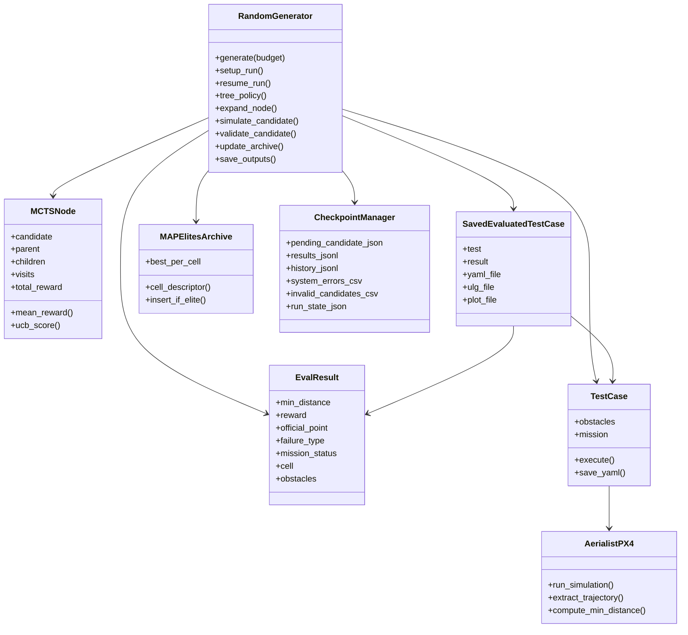
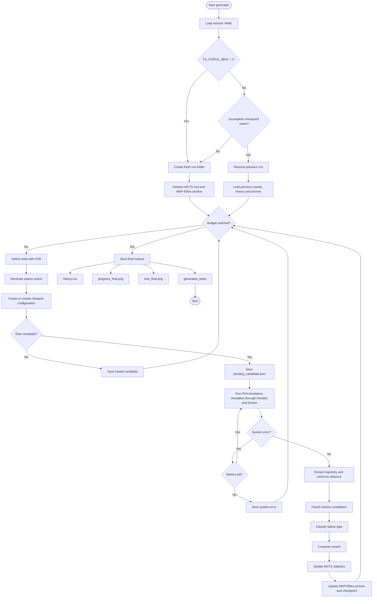
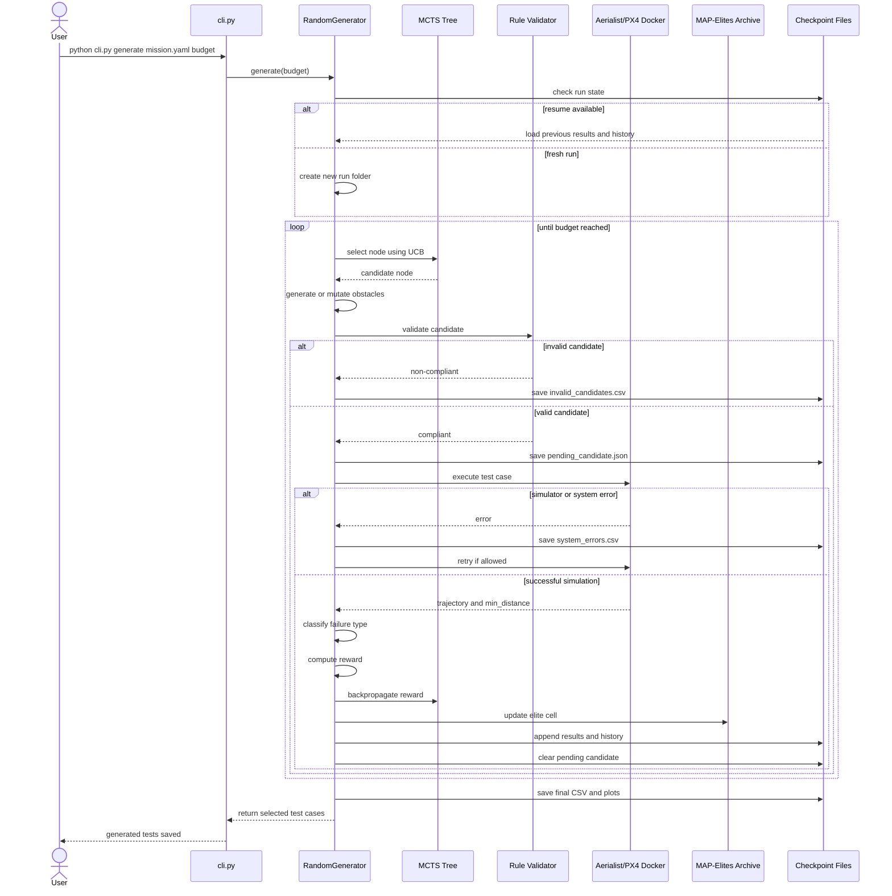

# TG-MCTS-Elites UAV Test Generator

Rule-compliant search-based test generator for the UAV Testing Competition.

This project automatically generates obstacle configurations for PX4-Avoidance missions and searches for scenarios where the UAV collides with, or passes dangerously close to, obstacles.

The generator combines:

- trajectory-guided generation;
- Monte Carlo Tree Search;
- MAP-Elites diversity preservation;
- rule-compliant obstacle validation;
- crash recovery and checkpointing.

---

## Project Goal

The objective is to automatically generate valid obstacle configurations that expose weaknesses in PX4-Avoidance.

Given a mission and a set of generated obstacles, the simulator returns the UAV trajectory. The main quantity optimized by the algorithm is:

```text
min_distance = minimum distance between the UAV trajectory and all generated obstacles
```

The search tries to minimize this value while keeping the test case valid.

| Type | Condition | Meaning |
|---|---:|---|
| Hard fail | `min_distance < 0.25 m` | Collision or almost-collision |
| Soft fail | `0.25 m <= min_distance < 1.5 m` | Unsafe close pass |
| Near miss | `1.5 m <= min_distance < 3.0 m` | Interesting but not officially unsafe |
| Safe | `min_distance >= 3.0 m` | Valid but less interesting |

---

## Repository Structure

```text
.
├── README.md
├── Dockerfile
├── requirements.txt
├── cli.py
├── src/
│   ├── __init__.py
│   ├── cli.py
│   ├── random_generator.py
│   └── testcase.py
├── scripts/
│   └── run_all_100.sh
├── case_studies/
│   ├── README.md
│   ├── mission1.yaml
│   ├── mission2.yaml
│   ├── mission3.yaml
│   ├── mission1.plan
│   ├── mission2.plan
│   └── mission3.plan
└── docs/
    └── uml/
        ├── class_diagram.mmd
        ├── execution_flow.mmd
        └── sequence_diagram.mmd
```

The root `cli.py` file is only a launcher.  
The actual implementation is inside `src/`.

---

## Official Test Generation Rules

The generator manipulates only obstacles.

Each generated obstacle is a rotated box defined by:

```text
position = (x, y, z, r)
size     = (l, w, h)
```

where:

| Parameter | Constraint |
|---|---:|
| `x` | `-40 <= x <= 30` |
| `y` | `10 <= y <= 40` |
| `z` | `z = 0` |
| `l` | `2 <= l <= 20` |
| `w` | `2 <= w <= 20` |
| `h` | `10 < h <= 25` |
| `r` | `0 <= r <= 90` |
| Number of obstacles | at most `3` |
| Overlap | obstacles must not overlap |
| Feasibility | the layout must not block the mission corridor |

The implementation checks:

- numerical bounds;
- rotated obstacle corners inside the valid area;
- rotated box overlap;
- physical feasibility using grid-based free-space connectivity;
- mission completion when the trajectory can be extracted.

---

## Algorithm Overview

The implemented algorithm is called **TG-MCTS-Elites**.

```text
TG-MCTS-Elites =
    Trajectory-Guided initialization
  + Monte Carlo Tree Search
  + MAP-Elites archive
```

The objective is to generate valid but challenging obstacle configurations.

---

## 1. Trajectory-Guided Generation

Instead of placing obstacles completely randomly, the generator samples obstacles near expected mission corridors.

It generates several families of scenarios:

- single blocker;
- two-obstacle gate;
- staggered obstacle layout.

This increases the probability of finding dangerous scenarios with a limited simulation budget.

---

## 2. Monte Carlo Tree Search

The MCTS tree represents successive obstacle modifications.

Each node contains one obstacle configuration.  
Each edge corresponds to one search action, for example:

- `init_single`
- `init_gate`
- `init_staggered`
- `mutate_local`
- `mutate_strong`
- `slide_y`
- `resize`
- `rotate`
- `tighten_gate`
- `add_blocker`

The selection step uses an Upper Confidence Bound score:

```text
UCB = mean_reward + C * sqrt(log(parent_visits + 1) / child_visits)
```

Progressive widening limits how many children can be expanded from a node. This is useful because the obstacle-generation space is continuous.

---

## 3. MAP-Elites Archive

MAP-Elites preserves diversity.

Each obstacle configuration is assigned to a behavioral cell:

```text
cell = (
    number_of_obstacles,
    x_position_bin,
    y_position_bin,
    compactness_bin,
    rotation_bin
)
```

For each cell, the archive stores the best candidate found so far.

This avoids returning many almost-identical tests.

---

## Reward Function

The reward favors:

- official failures;
- smaller minimum distance;
- fewer obstacles;
- mission completion;
- faster simulations.

The structure is:

```text
reward =
    failure_bonus
  + closeness_reward
  + simplicity_bonus
  + mission_bonus
  - time_penalty
```

where:

```text
failure_bonus    = 25 * official_point
closeness_reward = 5 / (0.2 + min_distance)
simplicity_bonus = 4 / number_of_obstacles
```

The official point is:

| Condition | Point |
|---|---:|
| `min_distance < 0.25` | 5 |
| `0.25 <= min_distance < 1.0` | 2 |
| `1.0 <= min_distance < 1.5` | 1 |
| `min_distance >= 1.5` | 0 |

---

## Main Files

### `src/random_generator.py`

Contains the TG-MCTS-Elites algorithm.

Main responsibilities:

- obstacle generation;
- rule validation;
- MCTS search;
- MAP-Elites archive;
- simulation execution;
- crash recovery;
- result ranking;
- plot generation.

### `src/testcase.py`

Wrapper around Aerialist/PX4 test execution.

Main responsibilities:

- create executable test cases;
- launch simulations;
- extract obstacle distances;
- save generated YAML files.

### `src/cli.py`

Command-line implementation.

### `cli.py`

Root launcher. It keeps the following command working:

```bash
python cli.py generate case_studies/mission1.yaml 10
```

### `scripts/run_all_100.sh`

Runs the full experiment:

```text
mission1: 100 simulations
mission2: 100 simulations
mission3: 100 simulations
```

---

## Installation

Activate the environment used for the project:

```bash
conda activate uav
```

Go to the project folder:

```bash
cd /home/roby/Projects/UAV-Testing-Competition/snippets
```

Install missing Python dependencies if needed:

```bash
python -m pip install -r requirements.txt
python -m pip install matplotlib
```

The simulator is executed through Docker using the Aerialist image:

```text
skhatiri/aerialist:2.0
```

---

## Quick Test

Run a small test first:

```bash
TG_FORCE_NEW=1 python cli.py generate case_studies/mission1.yaml 2
```

A successful run prints something similar to:

```text
Rule-compliant Robust TG-MCTS-Elites UAV Test Generator
Simulation 1/2
Simulation 2/2
2 test cases generated
```

The output ranking should contain cells with five values, for example:

```text
cell=(2, 3, 1, 1, 2)
```

The fifth value is the rotation bin.

---

## Full Experiment

Run 100 simulations for each mission:

```bash
./scripts/run_all_100.sh
```

This executes:

```bash
TG_FORCE_NEW=1 python cli.py generate case_studies/mission1.yaml 100
TG_FORCE_NEW=1 python cli.py generate case_studies/mission2.yaml 100
TG_FORCE_NEW=1 python cli.py generate case_studies/mission3.yaml 100
```

Total number of simulations:

```text
100 x 3 = 300 simulations
```

---

## Crash Recovery

The generator is designed to survive crashes.

Before each simulation, the current candidate is saved in:

```text
pending_candidate.json
```

Successful simulations are saved in:

```text
results.jsonl
history.jsonl
```

If the PC or simulator crashes, resume the interrupted mission without `TG_FORCE_NEW=1`.

Example:

```bash
python cli.py generate case_studies/mission1.yaml 100
```

The value `100` is interpreted as the total target budget, not 100 additional simulations.

For example, if 37 simulations were completed before the crash, the resumed run continues from simulation 38 and stops at 100.

---

## Outputs

Each run creates a folder:

```text
results/tg_mcts_elites/<run_id>/
```

Main outputs:

```text
history.csv
progress_final.png
tree_final.png
scenario_plots/
checkpoint/results.jsonl
checkpoint/history.jsonl
checkpoint/system_errors.csv
checkpoint/invalid_candidates.csv
```

The final generated tests are saved in:

```text
generated_tests/<run_id>/
```

Each selected test can include:

```text
test_i.yaml
test_i.ulg
test_i.png
```

---

## UML Diagrams

The UML diagrams are stored as Mermaid source files in:

- `docs/uml/class_diagram.mmd`
- `docs/uml/execution_flow.mmd`
- `docs/uml/sequence_diagram.mmd`

They are also rendered directly below by GitHub.

### Editing with Mermaid Live Editor

To edit a diagram visually:

1. Open the corresponding `.mmd` file.
2. Copy its content.
3. Paste it into Mermaid Live Editor.
4. Export the diagram again if a PNG or SVG version is needed.
5. Commit the updated `.mmd` source file.

---

### Class Diagram



---

### Execution Flow



---

### Sequence Diagram



---

## Notes on Aerialist Logs

Sometimes Aerialist prints:

```text
aerialist.px4.docker_agent - ERROR
```

This is not necessarily a failed simulation.

If the output also contains:

```text
entry - INFO - test finished
testcase - INFO - test finished
minimum_distance: ...
```

then the simulation completed successfully.

---

## What Is Not Uploaded to GitHub

The following files are intentionally ignored:

```text
results/
logs/
generated_tests/
*.ulg
__pycache__/
random_generator_backup_*.py
```

These files are large, generated locally, or only useful for debugging.

---

## Context

This project was developed for the UAV Testing Competition using PX4-Avoidance and Aerialist.

It focuses on automated obstacle-based test-case generation for UAV simulation.
